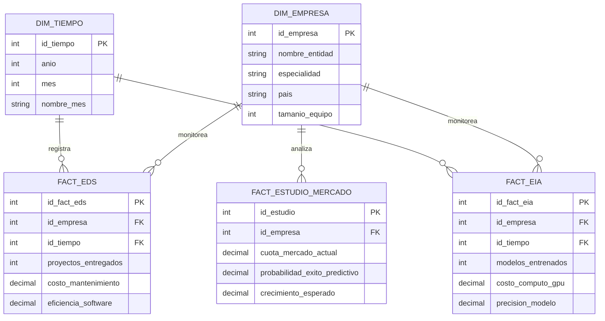

```mermaid
erDiagram
    DIM_EMPRESA ||--o{ FACT_EDS : "monitorea"
    DIM_EMPRESA ||--o{ FACT_EIA : "monitorea"
    DIM_TIEMPO ||--o{ FACT_EDS : "registra"
    DIM_TIEMPO ||--o{ FACT_EIA : "registra"
    
    DIM_EMPRESA {
        int id_empresa PK
        string nombre_entidad
        string especialidad
        string pais
        int tamanio_equipo
    }

    DIM_TIEMPO {
        int id_tiempo PK
        int anio
        int mes
        string nombre_mes
    }

    FACT_EDS {
        int id_fact_eds PK
        int id_empresa FK
        int id_tiempo FK
        int proyectos_entregados
        decimal costo_mantenimiento
        decimal eficiencia_software
    }

    FACT_EIA {
        int id_fact_eia PK
        int id_empresa FK
        int id_tiempo FK
        int modelos_entrenados
        decimal costo_computo_gpu
        decimal precision_modelo
    }

    FACT_ESTUDIO_MERCADO {
        int id_estudio PK
        int id_empresa FK
        decimal cuota_mercado_actual
        decimal probabilidad_exito_predictivo
        decimal crecimiento_esperado
    }

    DIM_EMPRESA ||--o{ FACT_ESTUDIO_MERCADO : "analiza"
```